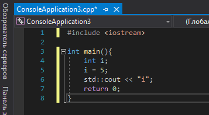

<!DOCTYPE HTML>
 <html>
 <head>
 </head>
 <body>
 
 МИНИСТЕРСТВО НАУКИ  И ВЫСШЕГО ОБРАЗОВАНИЯ РОССИЙСКОЙ ФЕДЕРАЦИИ  
Федеральное государственное автономное образовательное учреждение высшего образования  
"КРЫМСКИЙ ФЕДЕРАЛЬНЫЙ УНИВЕРСИТЕТ им. В. И. ВЕРНАДСКОГО"  
ФИЗИКО-ТЕХНИЧЕСКИЙ ИНСТИТУТ  
Кафедра компьютерной инженерии и моделирования
<br/><br/>
 
### Отчёт по лабораторной работе № 1<br/> по дисциплине "Программирование"
<br/>
 
студента 1 курса группы ИВТ-б-о-192(1)<br/>
Слободского Егора Вячеславовича<br/>
направления подготовки 09.03.01 "Информатика и вычислительная техника"  
<br/>
 
<table>
<tr><td>Научный руководитель<br/> старший преподаватель кафедры<br/> компьютерной инженерии и моделирования</td>
<td>(оценка)</td>
<td>Чабанов В.В.</td>
</tr>
</table>
<br/><br/>
 
Симферополь, 2019
 
 <hr>
 
# Лабораторная работа №1 Изучение базовых возможностей MS Visual Studio
 
  Цель: изучить основные возможности создания и отладки программ в IDE MS Visual Studio.
 
## Ход работы:
### 1) Как создать консольное приложение С++?
  
  Для создания нового консольного приложения запускаем Microsoft Visual Studio.
  <br/>
  В колонке "Начало работы" выбираю пункт **"Создание проекта"** (рис.1).
  
  <figure class="sign">
  
  <figcaption> <i><br/>Рис.1 Начальный экран MS VS </i></figcaption>
  </figure>
  <br/><br/>
  
  Затем выбираю пункт **"Консольное приложение"** (рис.2) и жму кнопку **"Далее"**.
  
  <figure class="sign">
  
  <figcaption><i><br/>Рис.2 Создание проекта</i></figcaption>
  </figure>
  <br/><br/>
  
  В следующем окне выбираю имя проекта, расположение проекта и имя решения с возможностью поместить решение и проект в одном каталоге (рис.3).
  <figure class="sign">
  
  <figcaption><i><br/>Рис.3 Создание проекта<i></figcaption>
  </figure>
  <br/><br/>
  
   Нажимаю кнопку **"Создать"**. <br/>Консольное приложение **готово**.
    
  ### 2) Как изменить цветовую схему (оформление) среды?
  
  В строке меню, где расположены разделы Файл и Изменить, выберите **Средства > Параметры**. <br/>
  Открываю страницу параметров **Окружение  > Общие**, изменяю значение "Цветовая тема" на нужную и щелкаю ОК.

  <figure class="sign">
  
  <figcaption><i><br/>Рис.4 Изменить цветовую схему<i></figcaption>
  </figure>
  <br/><br/>
 
  ### 3) Как закомментировать/раскомментировать блок кода средствами VS?
  
  Чтобы закомментировать блок кода необходимо выделить этот блок и комбинацией клавиш **[Ctrl]+[Shift]+[/]** закомментировать (рис.5). Точно такой-же комбинацией снимается комментирование.
  <figure class="sign">
  
  <figcaption><i><br/>Рис.5 Комментировать блок<i></figcaption>
  </figure>
  <br/><br/>
 
 ### 4) Как открыть в проводнике Windows папку с проектом средствами VS?
  
  Чтобы открыть папку через VS необходимо ввести комбинацию клавиш **[Ctrl]+[O]**.Откроется диалоговое окно "Открыть файл" (рис.6).
  <figure class="sign">
  
  <figcaption><i><br/>Рис.6 Диалоговое окно "Открыть файл"<i></figcaption>
  </figure>
  <br/><br/>
  
  Если не открывается стандартная директория, тогда можно ввести путь:
 
  > C:\Users\User\source\repos\ConsoleApplication3

  ### 5) Какое расширение файла-проекта используется в VS?
  
  В VS используется расширение файла-проекта **".vcxproj"** (рис.7).
  <figure class="sign">
  
  <figcaption><i><br/>Рис.7 Расширение файла-проекта<i></figcaption>
  </figure>
 <br/><br/>
 
 ## 6) Как запустить код без отладки (не менее 2 способов)?
 
 **1 способ -** Комбинацией клавиш [Ctrl]+[F5]; <br/><br/>
 **2 способ -** Через вкладку "Отладка". Во всплывшем списке выбираю "Запуск без отладки" (рис.8).
 
 <figure class="sign">
  
  <figcaption><i><br/>Рис.8 Запуск без отладки<i></figcaption>
  </figure>
  <br/><br/>
  
  ## 7) Как запустить код в режиме отладки (не менее 2 способов)?
  
 **1 способ -** Комбинацией клавиш [F5]; <br/><br/>
 **2 способ -** Через вкладку "Отладка". Во всплывшем списке выбираю "Начать отладку" (рис.9).
 
  <figure class="sign">
  
  <figcaption><i><br/>Рис.9 Запуск в режиме отладки<i></figcaption>
  </figure>
  <br/><br/>
  
  ## 8) Как установить/убрать точку останова (breakpoint)?
  
  Чтобы установить точку останова необходимо навести курсор на необходимую строку и кликнуть в столбце слева от поля ввода кода. Появится красная точка напротив строчки. Точка останова установлена.
  
  <figure class="sign">
  
  <figcaption><i><br/>Рис.10 Установка точки останова<i></figcaption>
  </figure>
  <br/><br/>
  
  Чтобы снять точку останова необходимо кликнуть на необходимую точку останова, в следствие чего она будет снята.
  
  ## 9) Создать программу со следующим кодом:
  
  ```c++
  #include <iostream>

  int main(){
      int i;
      i = 5;
      std::cout << "i";
      return 0;
  }
  ```
  Программа создана:
  
  <figure class="sign">
  
  <figcaption><i><br/>Рис.11 Программа с кодом<i></figcaption>
  </figure>
  <br/><br/>
  
  - Переключитесь в конфигурацию сборки **Debug**;
  - Установите brakepoint на 5 и 6 строках;
  - Запустите приложение в режиме отладки. Используйте кнопку **Продолжить** или **Шаг с обходом** для перемещения к следующей точке останова;
  <figure class="sign">
  
  <figcaption><i><br/>Рис.12 Brakepoint на 5 строке<i></figcaption>
  </figure>
  <br/>
  <figure class="sign">
  
  <figcaption><i><br/>Рис.13 Brakepoint на 6 строке<i></figcaption>
  </figure>
  <br/><br/>
  
  - Какое значение содержит переменная i в 5-й строке?<br/>
  Переменная i содержит значение **"-858993460"**;
  - Какое значение содержит переменная i в 6-й строке?<br/>
  Переменная i содержит значение **"5"**.<br/>
  
  ## 10) Выполните задание 9 изменив программу на следующую:
  ```c++
  #include <iostream>

  int main(){
      double i;
      i = 5;
      std::cout << "i";
      return 0;
  }
  ```  
  
  
  - Какое значение содержит переменная i в 5-й строке?<br/>
  **Переменная i содержит значение "-9.2559631349317831e+61"**;
  - Какое значение содержит переменная i в 6-й строке?<br/>
  **Переменная i содержит значение "5.0000000000000000"**.<br/>
  
  
  **Вывод:** в процессе выполнения данной лабораторной работы мною были получены начальные навыки использования программы Visual Studio и с языком разметки Markdown. В качестве языка программирования был использован язык C++.
  
 </body>
 </html>