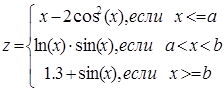
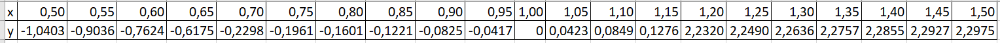
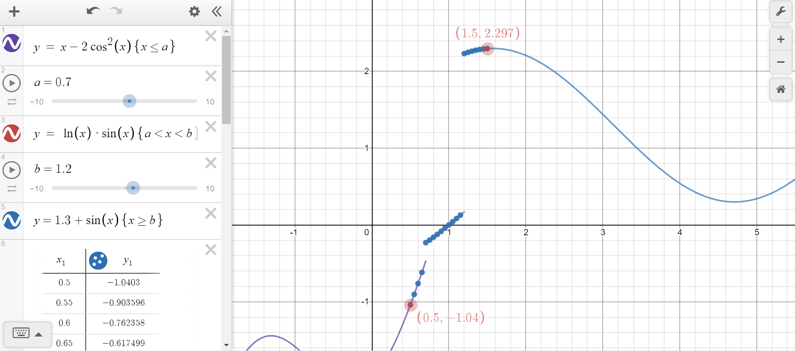

<!DOCTYPE HTML>
 <html>
 <head>
 <title>1lab_Slobodskoy</title>
 </head>
 <body>
 
 МИНИСТЕРСТВО НАУКИ  И ВЫСШЕГО ОБРАЗОВАНИЯ РОССИЙСКОЙ ФЕДЕРАЦИИ  
Федеральное государственное автономное образовательное учреждение высшего образования  
"КРЫМСКИЙ ФЕДЕРАЛЬНЫЙ УНИВЕРСИТЕТ им. В. И. ВЕРНАДСКОГО"  
ФИЗИКО-ТЕХНИЧЕСКИЙ ИНСТИТУТ  
Кафедра компьютерной инженерии и моделирования
<br/><br/>
 
### Отчёт по лабораторной работе № 2<br/> по дисциплине "Программирование"
<br/>
 
студента 1 курса группы ИВТ 192(1)  
Слободского Егора Вячеславовича
направления подготовки 09.03.01 "Информатика и вычислительная техника"  
<br/>
 
<table>
<tr><td>Научный руководитель<br/> старший преподаватель кафедры<br/> компьютерной инженерии и моделирования</td>
<td>(оценка)</td>
<td>Чабанов В.В.</td>
</tr>
</table>
<br/><br/>
 
Симферополь, 2019
 
 <hr>
 
 
# Лабораторная работа №2 "Табулирование кусочно-заданной функции"

Цель:

1. Овладеть практическими навыками разработки и программирования вычислительного процесса циклической структуры;
Сформировать навыков программирования алгоритмов разветвляющейся структуры;
2. Изучить операторы ветвления. Особенности использования полной и сокращенной формы оператора if и тернарного оператора. 
 
## Ход работы:
Напишите на языке С++ программу которая для функции **f(x)** на интервале **x ∈ [Xнач; Xкон]**:
* выводит в консоль значения функции **f(x)** с шагом **dx**;
* определяет максимальное и минимальное значение функции.<br/>
  
  <figure class="sign">
  
  <figcaption> <i>Рис.1 Функция </i></figcaption>
  </figure>
  
  <br/>
  
  **Код программы:**
 
 ```C++
#include <iostream>
#include <cmath>

using namespace std;

int main()
{
    double a, b, xStart, xEnd, dx;
    double x, F, fMin, fMax;

    cout << "Введите a:";
    cin >> a;
    cout << endl << "Введите b:";
    cin >> b;
    cout << endl << "Введите xStart:";
    cin >> xStart;
    cout << endl << "Введите xEnd:";
    cin >> xEnd;
    cout << endl << "Введите dx:";
    cin >> dx;

    for (x = xStart; x <= (xEnd + dx / 2); x += dx){
        if (x <= a) F = x - 2 * (pow(cos(x),2));
        else if (x > a && x < b) F = log(x) * sin(x);
        else if (x >= b) F = 1.3 + sin(x);
        
        if (x == xStart){ fMin = F; fMax = F; }

        if (F < fMin) fMin = F;
        if (F > fMax) fMax = F;
        if (abs(F) < 0.0000001) { F = 0; }
        
        cout << "F(" << x << ") = " << F << endl;
    }
    cout << endl << "Fmin = " << fMin;
    cout << endl << "Fmax = " << fMax;
}
```

**1.** Протабулируйте функцию и запишите получившиеся реультаты в отчёт в виде таблицы. При этом **a** = 0.7, **b** = 1.2, начала и конца интервала **Xнач** = 0.5, **Xкон** = 1.5 и шага **dx** = 0.05.<br/>
**2.** Определите минимальное и максимальное значение функции на указанном интервале.<br/>
**Fmin** = -1.0403  **Fmax** = 2.29749<br/>
**3.** Используя сервис https://www.desmos.com/calculator или подобный:<br/>
* постройте график функции;
* добавьте на график точки, которые у вас получились в процессе табуляции;
* добавьте на график точки минимума и максимума с метками значений;


<figure class="sign">
  
  <figcaption> <i>Рис.2 Значения </i></figcaption>
  </figure>

<figure class="sign">
  
  <figcaption> <i>Рис.3 Графики и точки </i></figcaption>
  </figure>
  
   
   Вывод: в ходе данной лабораторной работы я изучил нахождение значения функции с применением оператора "if". Также научился строить графики функций в веб приложении. 
  
  
 </body>
 </html>