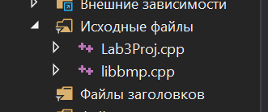
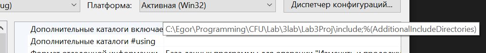
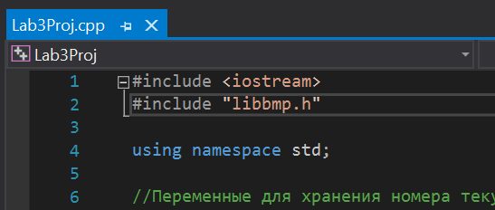
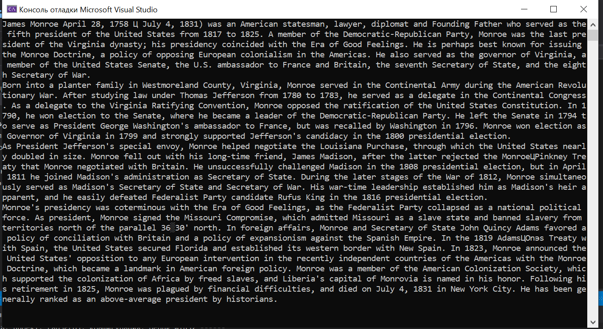

<!DOCTYPE HTML>
 <html>
 <head>
 </head>
 <body>
 
 МИНИСТЕРСТВО НАУКИ  И ВЫСШЕГО ОБРАЗОВАНИЯ РОССИЙСКОЙ ФЕДЕРАЦИИ  
Федеральное государственное автономное образовательное учреждение высшего образования  
"КРЫМСКИЙ ФЕДЕРАЛЬНЫЙ УНИВЕРСИТЕТ им. В. И. ВЕРНАДСКОГО"  
ФИЗИКО-ТЕХНИЧЕСКИЙ ИНСТИТУТ  
Кафедра компьютерной инженерии и моделирования
<br/><br/>
 
### Отчёт по лабораторной работе № 3<br/> по дисциплине "Программирование"
<br/>
 
студента 1 курса группы ИВТ-б-о-192(1)<br/>
Слободского Егора Вячеславовича<br/>
направления подготовки 09.03.01 "Информатика и вычислительная техника"  
<br/>
 
<table>
<tr><td>Научный руководитель<br/> старший преподаватель кафедры<br/> компьютерной инженерии и моделирования</td>
<td>(оценка)</td>
<td>Чабанов В.В.</td>
</tr>
</table>
<br/><br/>
 
Симферополь, 2019
 
 <hr>
 
 
# Лабораторная работа №2 "Дешифровка текста из изображения"

Цель:

1. Закрепить навыки разработки программ использующих операторы цикла;
2. Закрепить навыки разработки программ использующих массивы;
3. Освоить методы подключения сторонних библиотек. 

## Постановка задачи

Напишите на языке С++ программу, которая по заданному изображению и ключу восстанавливает исходное текстовое сообщение (Си-строка) зашифрованное в изображении.
 
## Ход работы:
**1.** Для работы с изображениями в формате bmp скачайте библиотеку https://github.com/marc-q/libbmp.
**2.** В скаченном репозитории найдите папку CPP, в ней расположены файлы которые нужно подключить к своему проекту, а так же пример использования библиотеки.
**3.** Файл libbmp.cpp скопируйте в папку проекта и добавьте к проекту.
  
  <figure class="sign">
  
  <figcaption> <i><br/>Рис.1 Файл подключен в проект </i></figcaption>
  </figure>
  
  <br/><br/>
  
**4.** В папке с проектом создайте папку include и скопируйте туда libbmp.h.
**5.** Подключаю папку с заголовочным файлом

  <figure class="sign">
  
  <figcaption> <i><br/>Рис.2 Подключил папку с библиотекой </i></figcaption>
  </figure>
  
  <br/><br/>
  
**6.** Теперь можно подключить библиотеку в свой проект. Для этого добавьте в главный файл вашей программы строку (после iostream).

  <figure class="sign">
  
  <figcaption> <i><br/>Рис.3 Подключил библиотеку </i></figcaption>
  </figure>
  
  <br/><br/>
  
**7.** В соответствии с вариантом:<br/>
  **Картинка:**
  <figure class="sign">
  
  <figcaption> <i><br/>Рис.4 Исходная картинка </i></figcaption>
  </figure>
  
  <br/>
  
  **Ключ:** 11r 11b 11g 01r 01b 01g 10r 10b
  
  <br/>
  
  
**9.** Декодируйте сообщение и выведите его в консоль.
  
  **Код программы для дешифровки текста:**
 
  ```C++
  #include <iostream>
  #include "libbmp.h"
  
  using namespace std;
  
  //Переменные для хранения номера текущего читаемого байта и бита соответствующе
  int Byte = 0, Bit = 7;
  //Массив символов (букв) в котором будет храниться полученное "послание"
  char message[100];
  //Нужна для завершения считывания
  bool finishPixPict = false;
  
  void addBitToMessage(char readBit)
  {
    //Если достиг конца картинки - заканчиваю операцию
    if (finishPixPict) return;
    
    //Сдвигаю бит в нужную позицию
    readBit <<= Bit;
    Bit--;
    message[Byte] |= readBit;
  
    // Переход к следующему байту
    if (Bit < 0){
      Bit = 7;
  
      if (message[Byte] == '\0') finishPixPict = true;
  
      Byte++;
    }
  }
  
  int main() {
    //Создаю экземпляр класса картинки
    BmpImg img;
    //Загружаю в него картинку
    img.read("images/pic5.bmp");
  
    //Переменные, которые будут хранить значение пикселя
    char bitOne, bitTwo, bitThree;
  
    //Прохожусь по всей картинке
    for (int y = img.get_height() - 1; y >= 0; y--)
      for (int x = img.get_width() - 1; x >= 0; x--) {
        //Ключ: 11r 11b 11g 01r 01b 01g 10r 10b
        //Будет хранить значение извлеченное из пикселя по красному цвету
        bitOne = img.red_at(x, y) & 0b1;
        //По синему
        bitTwo = img.blue_at(x, y) & 0b1;
        //По зеленому
        bitThree = img.green_at(x, y) & 0b1;
  
        //Вызываем функцию добавления символов из трех цветов пикселя в текст "послания"
        addBitToMessage(bitOne);
        addBitToMessage(bitTwo);
        addBitToMessage(bitThree);
        //И если прихожу в конец - выхожу из цикла
        if (finishPixPict) break;
      }
    //Вывожу на экран полученное "послание"
    cout << message << endl << endl;
  }
  ```

  **10.** Полученное сообщение:
  
  <figure class="sign">
  
  <figcaption> <i><br/>Рис.5 Результат считывания </i></figcaption>
  </figure>
  
  <br/><br/>


   
   **Вывод:** в ходе данной лабораторной работы я научился подключать к проекту сторонние библиотеки и использовать, данную в этой работе, для декодирования текста из картинки.
  
  
 </body>
 </html>