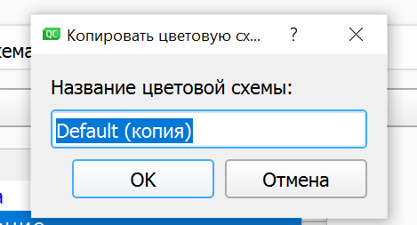
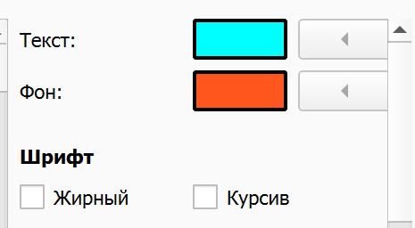
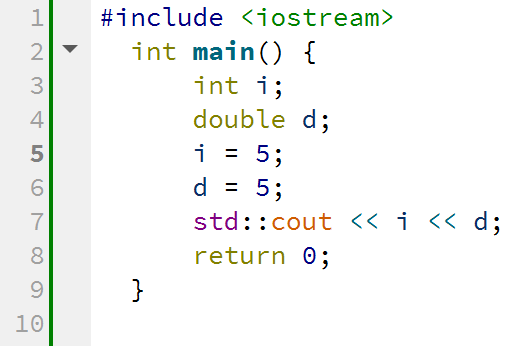
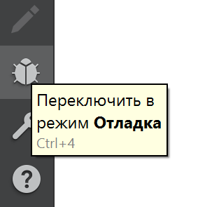

<!DOCTYPE HTML>
 <html>
 <body>
 
 МИНИСТЕРСТВО НАУКИ  И ВЫСШЕГО ОБРАЗОВАНИЯ РОССИЙСКОЙ ФЕДЕРАЦИИ  
Федеральное государственное автономное образовательное учреждение высшего образования  
"КРЫМСКИЙ ФЕДЕРАЛЬНЫЙ УНИВЕРСИТЕТ им. В. И. ВЕРНАДСКОГО"  
ФИЗИКО-ТЕХНИЧЕСКИЙ ИНСТИТУТ  
Кафедра компьютерной инженерии и моделирования
<br/><br/>
 
### Отчёт по лабораторной работе №7 <br/> по дисциплине "Программирование"
<br/>
 
студента 1 курса группы ИВТ-б-о-192(1)<br/>
Слободского Егора Вячеславовича<br/>
направления подготовки 09.03.01 "Информатика и вычислительная техника"  
<br/>
 
<table>
<tr><td>Научный руководитель<br/> старший преподаватель кафедры<br/> компьютерной инженерии и моделирования</td>
<td>(оценка)</td>
<td>Чабанов В.В.</td>
</tr>
</table>
<br/><br/>
 
Симферополь, 2019
 
 <hr>
 
# Лабораторная работа №7 Изучение базовых возможностей IDE Qt Creator

Цель:  изучить основные возможности создания и отладки программ в IDE Qt Creator. 
 
## Ход работы:
**1. Как создать консольное приложение С++ в IDE Qt Creator без использования компонентов Qt?**<br/> 
  
Чтобы создать консольное приложение С++ в IDE Qt Creator без использования компонентов Qt необходимо в панели инструментов сверху  окна пройти по пути **Файл > Создать файл или проект**,<br/>

  <figure class="sign">
  
  <figcaption> <i><br/>Рис.1 Вкладка "Файл" </i></figcaption>
  </figure>
  <br/>

в разделе Проекты выбрать **Проект без Qt**<br/>

  <figure class="sign">
  
  <figcaption> <i><br/>Рис.2 Раздел "Проекты" </i></figcaption>
  </figure>
  <br/>

и в области правее выбрать **Приложение на языке С++**.<br/>

  <figure class="sign">
  
  <figcaption> <i><br/>Рис.3 Выбор языка программы </i></figcaption>
  </figure>
  <br/>

Нажать кнопку **Выбрать**.<br/>

  <figure class="sign">
  
  <figcaption> <i><br/>Рис.4 Кнопка "Выбрать" </i></figcaption>
  </figure>
  <br/>
  
Затем выбираю путь, где будет храниться проект и само название проекта. Нажимаю кнопку **Далее**<br/>
  
  
  <figure class="sign">
  
  <figcaption> <i><br/>Рис.5 Название проекта и место его хранения </i></figcaption>
  </figure>
  <br/>
  
И далее идут настройки проекта.<br/>


**2. Как изменить цветовую схему (оформление) среды?<br/>
Чтобы изменить цветовую схему среды необходимо:**<br/> 

* Выбрать **Инструменты > Параметры... >**<br/>
  
  <figure class="sign">
  
  <figcaption> <i><br/>Рис.6 Вкладка "Инструменты" </i></figcaption>
  </figure>
  <br/>

Далее: **Текстовый редактор > Шрифт и цвета > Копировать**

  <figure class="sign">
  
  <figcaption> <i><br/>Рис.7 Вкладка "Шрифт и цвета" </i></figcaption>
  </figure>
  <br/><br/>

* Ввести имя для цветовой схемы и нажать **OK**.<br/>
  
  <figure class="sign">
  
  <figcaption> <i><br/>Рис.8 Ввод имени новой цветовой схемы </i></figcaption>
  </figure>
  <br/><br/>

* В поле **Текст** укажите цвет выделенного элемента кода.<br/>
 
  <figure class="sign">
  
  <figcaption> <i><br/>Рис.9 Выбор цвета из палитры </i></figcaption>
  </figure>
  <br/><br/>

* В поле **Фон** укажите цвет фона элемента кода.<br/>

  <figure class="sign">
  
  <figcaption> <i><br/>Рис.10 Установил цвета фона и текста </i></figcaption>
  </figure>
  <br/><br/>

Фон элемента **Текст** определяет цвет фона редактора кода.<br/>


**3. Как закомментировать/раскомментировать блок кода средствами Qt Creator?**<br/> 

Чтобы закомментировать или раскомментировать блок кода необходимо:<br/>

* Выделить блок кода<br/>

  <figure class="sign">
  
  <figcaption> <i><br/>Рис.11 Выделенный блок кода </i></figcaption>
  </figure>
  <br/>
  
* Нажать комбирацию клавиш **[Ctrl] + [/]**<br/>

  <figure class="sign">
  
  <figcaption> <i><br/>Рис.12 Закомментированный блок кода </i></figcaption>
  </figure>
  <br/>

**4. Как открыть в проводнике Windows папку с проектом средствами Qt Creator?**<br/> 

Чтобы открыть папку пректа необходимо в панели инструментов вверху окна программы перейти во вкладку **Файл** и выбрать пункт **Отрыть файл или проект**<br/>

  <figure class="sign">
  
  <figcaption> <i><br/>Рис.13 Вкладка "Файл" </i></figcaption>
  </figure>
  <br/>

Или ввести комбинацию клавиш **[Ctrl] + [O]**<br/>

**5. Какое расширение файла-проекта используется Qt Creator?**<br/> 

Файл проекта использует расширение **.pro**<br/> 

  <figure class="sign">
  
  <figcaption> <i><br/>Рис.14 Файл проекта </i></figcaption>
  </figure>
  <br/><br/>

**6. Как запустить код без отладки?**<br/> 

Чтобы запустить код без отладки нужно нажать на зеленый треугольник слева внизу, в панели инструментов.<br/> 

  <figure class="sign">
  
  <figcaption> <i><br/>Рис.15 Кнопка для запуска без отладки </i></figcaption>
  </figure>
  <br/><br/>

**7. Как запустить код в режиме отладки?**<br/> 

Чтобы запустить код без отладки нужно нажать на зеленый треугольник  с жучком, сидящем на нём, слева внизу, в панели инструментов.<br/> 

  <figure class="sign">
  
  <figcaption> <i><br/>Рис.16 Кнопка для запуска с отладкой </i></figcaption>
  </figure>
  <br/><br/>

**8. Как установить/убрать точку останова (breakpoint)?**<br/> 

Чтобы установить/убрать точку останова (breakpoint) необходимо навести курсор мыши в столбец, левее номера строки, и на уровне необходимой мне строки нажать ЛКМ. Если там уже стоит точка останова, тогда для снятия этой точки необходимо повторно на неё нажать.<br/> 

  <figure class="sign">
  
  <figcaption> <i><br/>Рис.17 Точка останова </i></figcaption>
  </figure>
  <br/><br/>

**9. Создайте программу со следующим кодом:**<br/>
  ```C++
  #include <iostream>
  int main() {
      int i;
      double d;
      i = 5;
      d = 5;
      std::cout << i << d;
      return 0;
  }
  ```
Создал:<br/>

  <figure class="sign">
  
  <figcaption> <i><br/>Рис.18 Код программы </i></figcaption>
  </figure>
  <br/><br/>
  
* Переключитесь в конфигурацию сборки «Отладка»;<br/>

  <figure class="sign">
  
  <figcaption> <i><br/>Рис.19 Кнопка для переключения в режим отладки </i></figcaption>
  </figure>
  <br/><br/>
  
* Установите breakpoint на 5, 6 и 7 строках;<br/>

  <figure class="sign">
  
  <figcaption> <i><br/>Рис.20 Breakpoint-ы на 5, 6 и 7 строках </i></figcaption>
  </figure>
  <br/><br/>

* Запустите приложение щелкнув по кнопке с изображением жука.<br/>

  <figure class="sign">
  
  <figcaption> <i><br/>Рис.21 Кнопка запуска проекта </i></figcaption>
  </figure>
  <br/><br/>

* Используйте эту же кнопку для перехода к следующей точке останова;<br/>

  <figure class="sign">
  
  <figcaption> <i><br/>Рис.22 Кнопка для перехода к следующей точке останова </i></figcaption>
  </figure>
  <br/><br/>

* Какое значение содержит переменная d в 6й строке?<br/>

Переменная d в 6й строке равна **6.78886e-319**.<br/>

  <figure class="sign">
  
  <figcaption> <i><br/>Рис.23 Значение переменных i и  d до инициализации </i></figcaption>
  </figure>
  <br/><br/>

* Какие значение содержатся в переменных i и  d в 7й строке?<br/>

Переменные i и  d в 7й строке равны **5**<br/>

  <figure class="sign">
  
  <figcaption> <i><br/>Рис.24 Значения переменных i и  d после инициализации </i></figcaption>
  </figure>
  <br/><br/>

* Совпадают ли эти значения с теми, что вы получали в MSVS для соответствующих типов?<br/>

Мусорное значение у переменных всегда разное, но после 7 строчки в Qt значение переменной b = 5, а в Visual Studio b = 5.00000000.<br/>

**10. Закройте проект и перейдите на вкладку «Начало» => «Примеры»;**<br/>

  <figure class="sign">
  
  <figcaption> <i><br/>Рис.25 Окно с примерами проектов </i></figcaption>
  </figure>
  <br/><br/>

**11. Выберите проект «Calculator Form Example». Для этого можно воспользоваться строкой поиска;**<br/>

  <figure class="sign">
  
  <figcaption> <i><br/>Рис.26 Поиск и выбор проекта «Calculator Form Example» </i></figcaption>
  </figure>
  <br/><br/>

**12. Изучите (по желанию) описание проекта в открывшемся окне;**<br/>

  <figure class="sign">
  
  <figcaption> <i><br/>Рис.27 Описание проекта </i></figcaption>
  </figure>
  <br/><br/>

**13. Сейчас вы находитесь на вкладке «Проекты». Выберите комплект сборки.**<br/>

Выбрал единственный, когторый есть.<br/>

  <figure class="sign">
  
  <figcaption> <i><br/>Рис.28 Комплект сборки </i></figcaption>
  </figure>
  <br/><br/>

**14. Перейдите на вкладку «Редактор» и запустите сборку проекта;**<br/>

Сборка прошла успешно.<br/>

  <figure class="sign">
  
  <figcaption> <i><br/>Рис.29 Прогресс процесса сборки </i></figcaption>
  </figure>
  <br/>

Выскочило окошко для ведения исходных данных
  
  <figure class="sign">
  
  <figcaption> <i><br/>Рис.30 Окно для ввода исходных данных </i></figcaption>
  </figure>
  <br/>

**15. В инспекторе проекта выберите файл «main.cpp». В этом файле установите курсор на слово «show» в строке calculator.show(); и нажмите F1. Изучите справочную информацию.**<br/>

  <figure class="sign">
  
  <figcaption> <i><br/>Рис.31 Справочная информация </i></figcaption>
  </figure>
  <br/><br/>

**16. В инспекторе проекта выберите файл «Формы» => «calculatorform.ui» и дважды счёлкните ЛКМ;**<br/>

  <figure class="sign">
  
  <figcaption> <i><br/>Рис.32 Вкладка "Дизайн" </i></figcaption>
  </figure>
  <br/><br/>

**17. Вы попали на вкладку «Дизайн». На форме замените английский текст на русский. Пересоберите проект.**<br/>

Изменения применились.<br/>

  <figure class="sign">
  
  <figcaption> <i><br/>Рис.33 Изменения в окошке для ввода данных </i></figcaption>
  </figure>
  <br/><br/>


   **Вывод:** в ходе данной лабораторной работы я изучил основной функционал создания и отладки программ в  IDE Qt Creator. Также сравнил с функционалом IDE MS Visual Studio.
  
 </body>
 </html>