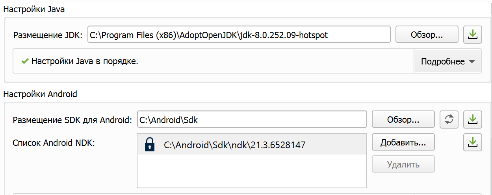

<!DOCTYPE HTML>
 <html>
 <body>
 
 МИНИСТЕРСТВО НАУКИ  И ВЫСШЕГО ОБРАЗОВАНИЯ РОССИЙСКОЙ ФЕДЕРАЦИИ  
Федеральное государственное автономное образовательное учреждение высшего образования  
"КРЫМСКИЙ ФЕДЕРАЛЬНЫЙ УНИВЕРСИТЕТ им. В. И. ВЕРНАДСКОГО"  
ФИЗИКО-ТЕХНИЧЕСКИЙ ИНСТИТУТ  
Кафедра компьютерной инженерии и моделирования
  
 
### Отчёт по лабораторной работе №8   по дисциплине "Программирование"
 
 
студента 1 курса группы ИВТ-б-о-192(1) 
Слободского Егора Вячеславовича 
направления подготовки 09.03.01 "Информатика и вычислительная техника"  
 
 
<table>
<tr><td>Научный руководитель  старший преподаватель кафедры  компьютерной инженерии и моделирования</td>
<td>(оценка)</td>
<td>Чабанов В.В.</td>
</tr>
</table>
  
 
Симферополь, 2019
 
 

 
# Лабораторная работа №8 Настройка Qt Creator для разработки приложений под android

**Цель:**

1. Настроить IDE Qt Creator для разработки приложений под android ОС; 
2. Изучить базовые понятия связанные с мобильной разработкой; 
3. Научиться создавать мобильные приложения при помощи фреймворка Qt 5.14. 

**Инструменты** 
1. IDE Qt Creator с набором предварительно собранных компонент фреймворка Qt 5.14 для android (560 Мб); 
2. Java SE Development Kit 8 (JDK) или OpenJDK 8 (100 Мб); 
3. Android Studio (749 Mб); 
4. Компоненты для сборки приложений (3 Гб); 
5. Genymotion (250 Мб + (образ) 350 Мб). 
 
## Ход работы:
**1.** В ходе выполнения лабораторной работы были подключены все необходимые компоненты, такие как SDK, NDK, компоненты Android, OpenSSl, язык Java. 

Мы видим, что JDK установлен правильно и найден средой Qt. Но вот SDK не хочет подключаться, хотя оно и найдено средой.

  <figure class="sign">
  
  <figcaption> <i> Рис. JDK и SDK</i></figcaption>
  </figure>
    

Также  и OpenSSL подключен и с ним всё впорядке. 
 
  <figure class="sign">
  
  <figcaption> <i> Рис. OpenSSL</i></figcaption>
  </figure>
    

Но обнаружилась ошибка с которой сложно что-то сделать. 

На следующем скриншоте представлен вывод об установленных и подключенных компонентах. Как видно из скриншота всё подключено, но есть ошибка. 
  
  <figure class="sign">
  
  <figcaption> <i> Рис. Компоненты</i></figcaption>
  </figure>
    

Проблема заключается в неправильности установки компонентов в ОС Windows и чтобы исправить ошибку необходимо переустановить всю систему. И даже это не гарантирует решение сложившейся ситуации. 
Ошибка проекта представлена на следующем скриншоте: 

Ошибка в профилях Qt (Инструменты->Параметры->Комплекты->Профили Qt):
  <figure class="sign">
  
  <figcaption> <i> Рис. Ошибка в профилях Qt</i></figcaption>
  </figure>
    
 
   **Вывод:** так как лабораторная работа не была завершена, то могу заключить, что я научился подключать элементы для разработкти приложений под Android, но не смог проверить это на практике.
  
 </body>
 </html>