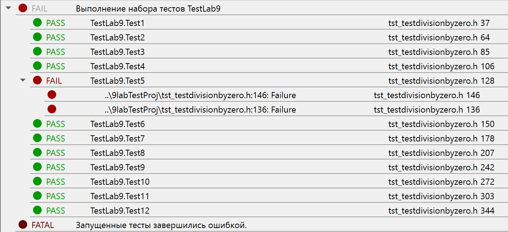
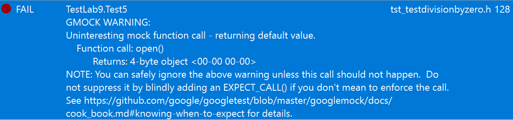

<!DOCTYPE HTML>
 <html>
 <body>
 
МИНИСТЕРСТВО НАУКИ  И ВЫСШЕГО ОБРАЗОВАНИЯ РОССИЙСКОЙ ФЕДЕРАЦИИ  
Федеральное государственное автономное образовательное учреждение высшего образования  
"КРЫМСКИЙ ФЕДЕРАЛЬНЫЙ УНИВЕРСИТЕТ им. В. И. ВЕРНАДСКОГО"  
ФИЗИКО-ТЕХНИЧЕСКИЙ ИНСТИТУТ  
Кафедра компьютерной инженерии и моделирования
  
 
### Отчёт по лабораторной работе №9   по дисциплине "Программирование"
 
 
студента 1 курса группы ИВТ-б-о-192(1) 
Слободского Егора Вячеславовича 
направления подготовки 09.03.01 "Информатика и вычислительная техника"  
 
 
<table>
<tr><td>Научный руководитель  старший преподаватель кафедры  компьютерной инженерии и моделирования</td>
<td>(оценка)</td>
<td>Чабанов В.В.</td>
</tr>
</table>
  
 
Симферополь, 2019
 
 

 
# Лабораторная работа №9 Тестирование при помощи Google Test Framework

Цель: 

1. Познакомиться с Google Test и Google Mock Framework; 
2. Изучить базовые понятия относящийся к тестированию кода; 
3. Научиться тестировать классы в среде разработки Qt Creator. 

## Ход работы:
**1.** Подготовка «боевого» проекта 
Скачал [архив](<https://neroid.ru/wp-content/uploads/2020/05/Lab9_Project_for_tests.zip>) с проектом и распаковал его. 
**2.** Создание тестового проекта в Qt Creator 
* Скачал архивом Google Test и Google Mock Framework из официального [репозитория](<https://github.com/google/googletest>). 
* Запустил Qt Creator и создал тестовый проект в Qt Creator. 
**3.** Проверил работоспособность пустого тестового проекта. 
**4.** Настроил тестовый проект. 
**5.** Реализовал нужные тесткейсы. 
 

Результаты проведённого тестирования: 
  <figure class="sign">
  
  <figcaption> <i> Рис.1. Результаты тестирования </i></figcaption>
  </figure>
    
  
Развернуто об ошибке: 
На данном скриншоте представлен общий отчёт об ошибке. 
  <figure class="sign">
  
  <figcaption> <i> Рис.2. Общее описание ошибки </i></figcaption>
  </figure>
    
  
И подробнее на следующих скриншотах: 
  <figure class="sign">
  
  <figcaption> <i> Рис.3. Подробности о 146 строке </i></figcaption>
  </figure>
    
  
  <figure class="sign">
  
  <figcaption> <i> Рис.4. Подробности о 136 строке </i></figcaption>
  </figure>
    

Не правильно реализованный метод: 
  <figure class="sign">
  
  <figcaption> <i> Рис.5. Не правильно реализованный метод </i></figcaption>
  </figure>
    
  
Правильная реализация кода: 
  <figure class="sign">
  
  <figcaption> <i> Рис.6. Правильно реализованный метод </i></figcaption>
  </figure>
    
  
  **Ссылка на [проект](<https://github.com/EgorEast/CFU/tree/master/Lab/9lab/9labTestProj>).** 
  
  **Каким образом могла возникнуть эта ошибка?** Она богла быть допущена в процессе предыдущего предыдущего метода, в котором программист, разработавший этот код, забыл поменять имя вызванной функции latch->open() на latch->close(). 
  
   **Вывод:** в процессе выполнения этой лабораторной работы я низучил Google Test и Google Mock Framework, научился писать простые тесткейсы и благодаря тестированию в Qt Creator смог выявить и найти решение ошибки.
   
 </body>
 </html>